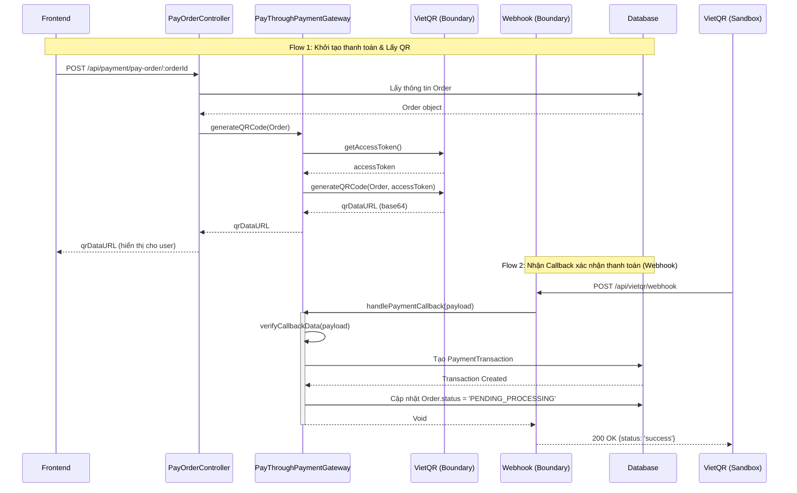

# Luồng hoạt động Backend: Thanh toán qua VietQR

Tài liệu này giải thích chi tiết cách thức hoạt động của luồng thanh toán VietQR trên backend, tuân thủ chặt chẽ theo kiến trúc **BCE (Boundary - Control - Entity)** của dự án AIMS.

## 1. Thành phần kiến trúc (BCE)

Hệ thống chia làm 3 lớp chính:
- **Boundary (Giao diện / Giao tiếp ngoài):**
  - `VietQRBoundary` ([viet-qr.service.ts](file:///e:/HUST/3_Third_year/20252/ITSS_Software_Development_IT4549E/AIMS_Programming/backend/src/boundaries/viet-qr/viet-qr.service.ts)): Đóng vai trò gọi API ra bên ngoài (lấy Token, gọi VietQR API để tạo QR). Trong chế độ sandbox, lớp này giả lập thời gian trễ của network và trả về dữ liệu mẫu.
  - `VietQRWebhookBoundary` ([viet-qr-webhook.boundary.ts](file:///e:/HUST/3_Third_year/20252/ITSS_Software_Development_IT4549E/AIMS_Programming/backend/src/boundaries/viet-qr/viet-qr-webhook.boundary.ts)): Đóng vai trò nhận dữ liệu (Webhook) từ hệ thống ngân hàng (VietQR) đẩy về khi khách hàng thanh toán thành công.

- **Control (Điều khiển logic):**
  - `PayOrderController` ([pay-order.controller.ts](file:///e:/HUST/3_Third_year/20252/ITSS_Software_Development_IT4549E/AIMS_Programming/backend/src/payment/controllers/pay-order.controller.ts)): Controller đóng vai trò giao tiếp trực tiếp với Frontend. Nhận request yêu cầu thanh toán từ người dùng và điều phối luồng.
  - `PayThroughPaymentGatewayController` ([pay-through-payment-gateway.service.ts](file:///e:/HUST/3_Third_year/20252/ITSS_Software_Development_IT4549E/AIMS_Programming/backend/src/payment/services/pay-through-payment-gateway.service.ts)): Chứa logic nghiệp vụ cốt lõi của việc thanh toán cổng điện tử. Đảm nhiệm việc xác thực dữ liệu webhook và tạo dữ liệu giao dịch.

- **Entity (Thực thể dữ liệu):**
  - `PaymentTransaction` ([payment-transaction.entity.ts](file:///e:/HUST/3_Third_year/20252/ITSS_Software_Development_IT4549E/AIMS_Programming/backend/src/payment/entities/payment-transaction.entity.ts)): Lưu trữ lịch sử giao dịch thanh toán (số tiền, phương thức, mã tham chiếu, chi tiết payload).
  - `Order`: Chứa thông tin đơn hàng hiện tại của khách.

---

## 2. Biểu đồ Sequence Diagram

Dưới đây là 2 luồng hoạt động chính:
1. **Flow 1:** Người dùng bấm "Thanh toán", backend tạo QR code và trả về cho frontend hiển thị.
2. **Flow 2:** Người dùng quét QR thanh toán thành công, hệ thống ngân hàng (VietQR) gọi API Webhook về backend AIMS để xác nhận.

---

## 3. Trình tự chạy code chi tiết (File & Function Level)

Để bạn dễ dàng trace code, dưới đây là luồng chạy chính xác qua từng file và hàm theo đúng thứ tự thời gian.

### Flow 1: Quy trình khởi tạo thanh toán & Lấy mã QR
Bắt đầu khi người dùng ở giao diện thanh toán.

1. **Frontend (Kích hoạt yêu cầu):**
   - **File:** `frontend/src/app/boundaries/vietqr-payment-screen/vietqr-payment-screen.component.ts`
   - **Hàm:** `ngOnInit()` -> `requestPayment()`
   - **Thực thi:** Gọi HTTP POST tới endpoint `/api/payment/pay-order/:orderId` của Backend. Quá trình này sẽ bật cờ `loading = true` để quay spinner chờ mã QR.

2. **Backend (Tiếp nhận HTTP Request):**
   - **File:** `backend/src/payment/controllers/pay-order.controller.ts`
   - **Hàm:** `@Post() payOrder(@Param('orderId') orderId)`
   - **Thực thi:** 
     - Hứng request, dùng `orderRepo.findOne` truy vấn database để lấy thông tin đơn hàng (`invoice`).
     - Gọi tiếp hàm nghiệp vụ: `this.paymentGatewayController.generateQRCode(invoice)`.

3. **Backend (Xử lý nghiệp vụ Gateway):**
   - **File:** `backend/src/payment/services/pay-through-payment-gateway.service.ts`
   - **Hàm:** `generateQRCode(invoice)`
   - **Thực thi:** Đóng vai trò người điều phối, hàm này sẽ gọi ra `VietQRBoundary` theo 2 bước:
     - `await this.vietQRBoundary.getAccessToken()`
     - `await this.vietQRBoundary.generateQRCode(invoice, accessToken)`

4. **Backend (Gọi API bên ngoài - Sandbox):**
   - **File:** `backend/src/boundaries/viet-qr/viet-qr.service.ts`
   - **Hàm:** `getAccessToken()` và `generateQRCode()`
   - **Thực thi:** Ở môi trường Sandbox này, thay vì gọi HTTP request ra server VietQR thực sự, các hàm này dùng `setTimeout` để mô phỏng delay của network (500ms).
   - Hàm `generateQRCode` trả về cứng một chuỗi Data URL Base64 ảnh QR mẫu (`dummyQr`).
   - Dữ liệu ảnh này sau đó lội ngược trở lại hàm `payOrder` (bước 2) và trả HTTP 200 OK về cho Frontend. Frontend nhận URL ảnh và hiển thị lên UI.

---

### Flow 2: Quy trình Webhook (Xác nhận thanh toán)
Sau khi user thấy QR, họ quét bằng app ngân hàng (hoặc ấn nút Test Simulator trên Frontend).

1. **Bên ngoài (Ngân hàng / Sandbox Simulator gọi vào):**
   - **File Sandbox Test:** `frontend/.../vietqr-payment-screen.component.ts`
   - **Hàm Test:** `simulateCallback()`
   - **Thực thi:** Đóng giả hệ thống server VietQR, gửi POST request chứa json payload giả lập (gồm `orderId`, `amount`, `status`) vào endpoint Webhook của Backend.

2. **Backend (Hứng Webhook):**
   - **File:** `backend/src/boundaries/viet-qr/viet-qr-webhook.boundary.ts`
   - **Hàm:** `@Post() paymentCallback(@Body() transactionResult)`
   - **Thực thi:** Ghi log việc nhận được payload từ ngân hàng. Lập tức đẩy payload này sang lớp Control qua hàm: `this.paymentGatewayController.handlePaymentCallback(transactionResult)`.

3. **Backend (Xác thực dữ liệu Webhook):**
   - **File:** `backend/src/payment/services/pay-through-payment-gateway.service.ts`
   - **Hàm:** `handlePaymentCallback()` -> `verifyCallbackData(transactionResult)`
   - **Thực thi:** 
     - Kiểm tra nhanh dữ liệu truyền vào có bị thiếu fields quan trọng không (như `orderId`, `amount`).
     - Nếu thiếu, ném ra lỗi `BadRequestException`. Nếu hợp lệ, tiếp tục chuyển xuống hàm lưu dữ liệu.

4. **Backend (Lưu Transaction & Cập nhật Order):**
   - **File:** `backend/src/payment/services/pay-through-payment-gateway.service.ts`
   - **Hàm:** `saveTransaction(transactionResult)` (Private)
   - **Thực thi:**
     - Query DB lại `Order` dựa vào `transactionResult.orderId`.
     - Tạo một bản ghi entity `PaymentTransaction` mới thông qua TypeORM (`paymentTransactionRepo.create`), map các trường: `amount`, `paymentMethod = 'VIETQR'`, `status` = SUCCESS/FAILED, và trích xuất payload webhook lưu vào dạng JSON. Sau đó lưu vào Database (`paymentTransactionRepo.save`).
     - Nếu thanh toán thành công (SUCCESS), gán `order.status = 'PENDING_PROCESSING'` và lưu cập nhật đơn hàng.
   - Kết thúc quá trình, `VietQRWebhookBoundary` trả HTTP 200 về cho phía VietQR (Ngân hàng) biết là hệ thống đã xử lý thành công.

5. **Frontend (Chuyển trang):**
   - **Thực thi:** Trong mô phỏng Sandbox, ngay sau khi gọi API webhook thành công, Frontend báo "Payment Successful" rồi dùng Router điều hướng về trang chủ (`/`). Ở thực tế, Frontend sẽ gọi polling (hỏi liên tục backend) hoặc dùng WebSocket để bắt được event cập nhật đơn hàng.
